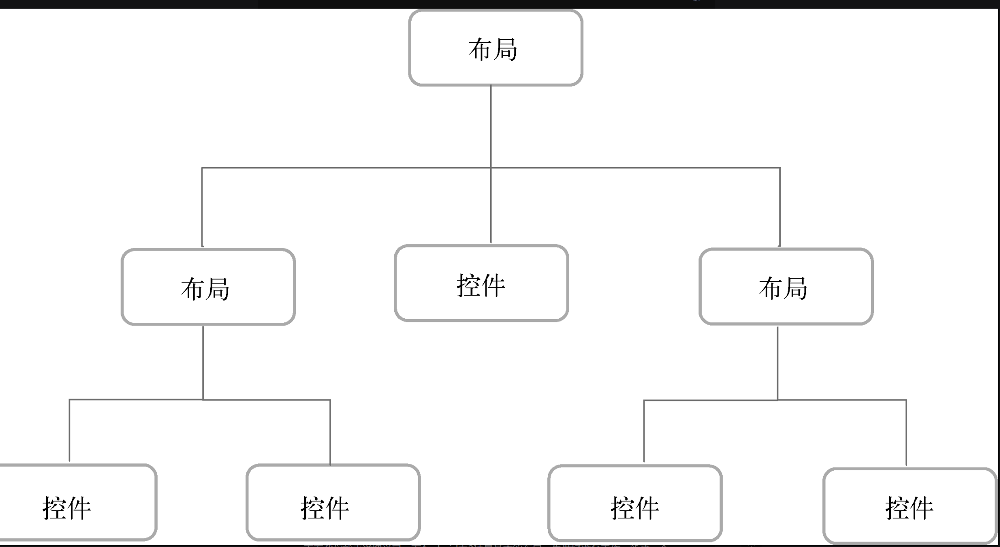
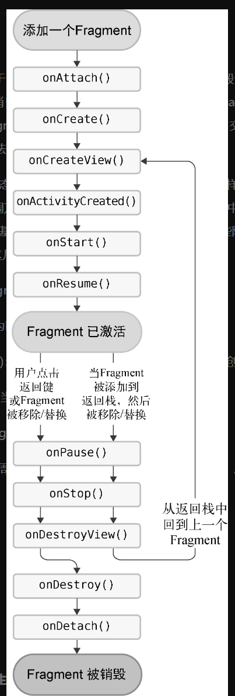
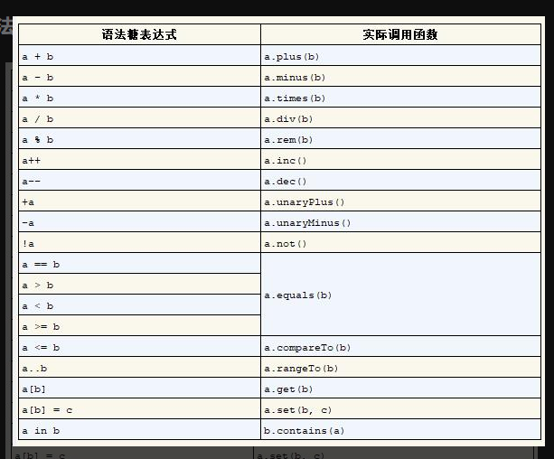

固定值表示表示给控件指定一个固定的尺寸，单位一般用dp，这是一种屏幕密度无关的尺寸单位，可以保证在不同分辨率的手机上显示效果尽可能地一致，如50 dp就是一个有效的固定值。

invisible表示控件不可见，但是它仍然占据着原来的位置和大小，可以理解成控件变成透明状态了。gone则表示控件不仅不可见，而且不再占用任何屏幕空间

当然，使用lateinit关键字也不是没有任何风险，如果我们在adapter变量还没有初始化的情况下就直接使用它，那么程序就一定会崩溃，并且抛出一个UninitializedPropertyAccessException异常
Sealed class（密封类） 是一个有特定数量子类的类，看上去和枚举有点类似，所不同的是，在枚举中，我们每个类型只有一个对象（实例）；而在密封类中，同一个类可以拥有几个对象。

Sealed class（密封类）的所有子类都必须与密封类在同一文件中

Sealed class（密封类）的子类的子类可以定义在任何地方，并不需要和密封类定义在同一个文件中

Sealed class（密封类）没有构造函数，不可以直接实例化，只能实例化内部的子类
————————————————

                        
Fragment的生命周期
也分为运行态，暂停态，停止态，销毁态
onAttach() 绑定fragment 和 activity
onCreateview(): 加载布局
onActvityCreated() -> onDestoryView() -> onDeatch()

一个运算符可以多次重载

 inflater.inflate(R.layout.right_fragment,container,false) 意味者将第一个参数，加入到第二个参数指定的容器中，如果第三个参数是false,则需要自己手动添加，如果是true，则立马添加
 使用 add 方法时，新的 Fragment 会添加到容器中，而不移除已有的 Fragment。
使用 replace 方法时，新的 Fragment 会替换掉容器中所有现有的 Fragment，确保容器中只有一个 Fragment。

